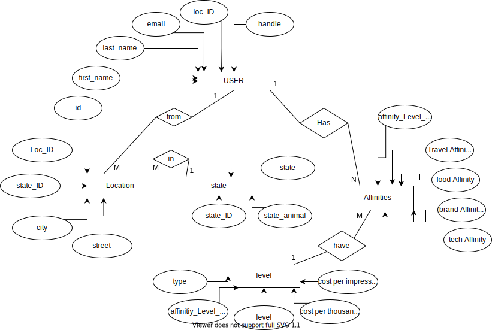

# Exam #1

The solutions content of this file below will be updated according to [the instructions](instructions/instructions.md).

## Solutions

The following sections contain a report on the solutions to each of the required components of this exam.

### Data munging

The code in the Python program, [solution.py](solution.py), contains the solutions to the **data munging** part of this exam.

### Spreadsheet analysis

The spreadsheet file, [users.xlsx](./data/users.xlsx), contains the solutions to the **spreadsheet analysis** part of this exam. In addition, the formulas used in that spreadsheet are indicated below:

**Make sure that all spreadsheet formulae you enter into this document work exactly as written.**

1. Total number of users of the social network

```
Place your formula here.
=COUNT(A2:A1001)
```

2. Number of users in each of the states in the New England region.

```
Place your formula here.
=COUNTIF($H$2:$H$1001,N5)
=COUNTIF($H$2:$H$1001,N6)
=COUNTIF($H$2:$H$1001,N7)
=COUNTIF($H$2:$H$1001,N8)
=COUNTIF($H$2:$H$1001,N9)
=COUNTIF($H$2:$H$1001,N10)
```

3. Number of users in each of the 5 most populous cities of the USA.

```
Place your formula for just the zip code 11201 here.
=countifs($H$2:$H$1001,O13,$G$2:$G$1001,N13)
```

4. The average affinity category IDs of all users in New York for each of the content types.

```
Place your formula here.
=averageif($H$2:$H$1001,O20,I2:I1001)
=averageif($H$2:$H$1001,O21,J2:J1001)
=averageif($H$2:$H$1001,O22,K2:K1001)
=averageif($H$2:$H$1001,O23,L2:L1001)
```

### SQL queries

This section shows the SQL queries that you determined solved each of the given problems.

**Make sure that all SQL commands you enter into this document work exactly as written, including semi-colons, where necessary.**

1. Write two SQL commands to create two tables named `users` and `affinity_categories` within the given database file.

```sql
Place your first command here.
CREATE TABLE users(
id INTEGER PRIMARY KEY, 
handle TEXT, 
first_name TEXT, 
last_name TEXT, 
email TEXT, 
street TEXT, 
city TEXT, 
state TEXT, 
state_animal TEXT, 
eal_food_affinity_category_id INTEGER, 
luxury_brand_affinity_category_id INTEGER, 
tech_gadget_affinity_category_id INTEGER, 
travel_affinity_category_id INTEGER
);
)
```

```sql
Place your second command here.
CREATE TABLE affinity_categories(
id INTEGER PRIMARY KEY, 
type TEXT, 
level REAL, 
cost_per_impression REAL, 
cost_per_thousand);
```

2. Import the data in the `users.csv` and `affinity_categories.csv` CSV files into these two tables.

```sql
Place your first command(s) here.
.import --skip 1 /Users/saeed/Desktop/exam-1-mas1780/data/users.csv users
```

```sql
Place your second command(s) here.
.import -- skip 1 /Users/saeed/Desktop/exam-1-mas1780/data/affinity_categories.csv affinity_categories
```

3. Display the state name and the number of users in that state for each of the states for which we have users.

```sql
Place your query here.
select state, count(id) from users group by state; 
```

4. Display the state name, the number of users in that state, and the average `real_food_affinity_category_id` for each of the states for which we have users.

```sql
Place your query here.
select state, count(id), avg(eal_food_affinity_category_id) from users group by state; 
```

5. Display the email addresses only of all users residing in Oklahoma City, Oklahoma.

```sql
Place your query here.
select email from users where city= "Oklahoma City" and state= "Oklahoma"; 
```

6. Display the email addresses of all users residing in Oklahoma City, Oklahoma, along with the price the social network would charge an advertiser to show one advertisement to each of them.

```sql
Place your query here.
select users.email , affinity_categories.cost_per_impression from users inner join affinity_categories on users.travel_affinity_category_id = affinity_categories.id where users.state = "Oklahoma" and users.city = "Oklahoma City"; 
```

7. Display the amount the social network would charge an advertiser to show one advertisement to two thousand users with a `real_food_affinity` level of `0.5`.

```sql
Place your query here.
select avg(cost_per_thousand)*2 from affinity_categories where level=0.5;
```

8. Show all the users for whom the `luxury_brand_affinity_category_id` field contains an invalid foreign key.

```sql
Place your query here.
select users.id from users left join affinity_categories on users.luxury_brand_affinity_category_id= affinity_categories.id where affinity_categories.id is null; 
```

9. Write an additional SQL query of your choice using SQL with this table; then describe the results

Write a description of the query here.
The query gives me a list of the first names of all inidividuals that have a higher affinity for tech gadgets (>10)

```sql
Place your query here.
select first_name from users where tech_gadget_affinity_category_id>10;
```

### Normalization and Entity-relationship diagramming

This section contains responses to the questions on normalization and entity-relationship diagramming.

1. Is the data in `users.csv` in fourth normal form?

```
Enter your response here
It is not in 4NF
```

2. Explain why or why not the `users.csv` data meets 4NF.

```
Enter your response here
In order to be in 4NF there should not exist any multi-valued dependency. Non-key fields must not be dependent upon each other e.g state depends on city; a non-key field must not be a fact about anything other than the key-field. 
```

3. Is the data in `affinity_categories.csv` in fourth normal form?

```
Enter your response here
It is in 4NF
```

4. Explain why or why not the `affinity_categories.csv` data meets 4NF.

```
Enter your response here
The non-key fields (fields other than id) are not facts about one another and are facts about the key field. Moreoever, there exist less than 2 multi-valued dependencies in this table. 
```

5. Use [draw.io](https://draw.io) to draw an Entity-Relationship Diagram showing a 4NF-compliant form of this data, including primary key field(s), relationship(s), and cardinality.


